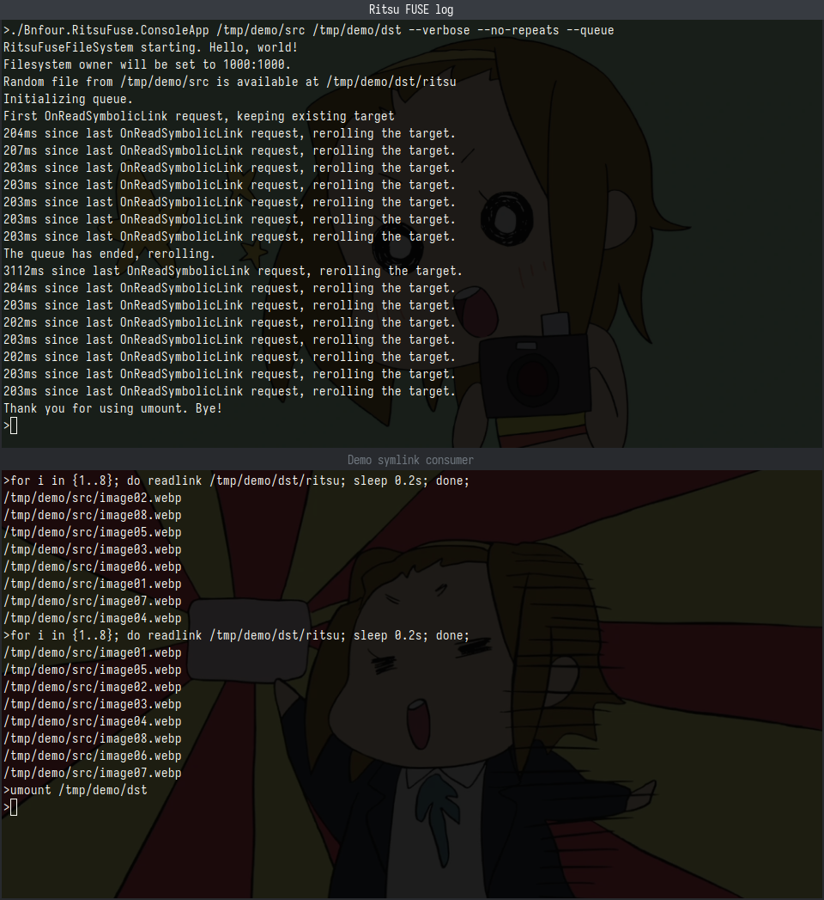

# Ritsu FUSE
_(originally derived from "Random Target Symlink + Filesystem in Userspace")_

**Ritsu FUSE** is a .NET app and/or library to create custom filesystems which contain symbolic links that change targets to a random file from a given folder after each "meaningful" read. "Meaningful" as in "the app probably does all the reads it needed in a small amount of time".

The main use is probably the extension of apps that only support loading a single file from fixed path for some purpose. By providing it with a Ritsu FUSE symlink, you can trick it to load different files every invocation. Unless it has an aggressive cache.

## Disclaimers
Don't take it too seriously. It's more of a quick-and-dirty concept implementation than a production-ready robust app.

I have a vague understanding of FUSE internals and related mono wrappers, the app just works (for me; most of the time). I cannot guarantee this app is free of errors, remember the all-caps "the software is provided 'as is'" section from the license. If you know how to improve the app's behaviour, you're welcome to send pulls.

A lot of insight was gained from [this article](http://www.maastaar.net/fuse/linux/filesystem/c/2016/05/21/writing-a-simple-filesystem-using-fuse/). It's a way better way to learn FUSE hands-on than this repo.

###### Why?
That's an excellent question! I'm torn between "why not" and "no idea" ¯\\\_(ツ)\_/¯

I had that random silly idea when I was thinking about ways to "improve" another app. I since figured out a better way to do that, but this "random symlink lule" thought stuck and I later found an article about FUSE -- so here it is, for everyone's enjoyment(?).

It is also my first time using [System.Commandline](https://learn.microsoft.com/en-us/dotnet/standard/commandline/); I must say it's really cool. I always missed [python's argparse](https://docs.python.org/3/library/argparse.html)-like stuff in my favourite framework.

###### Why "Ritsu"?
It just came to my mind when I was expanding "RTS" (as in "random target symlink") to words to use with "FUSE" as a name. I also like 「K-ON!」 (you probably can tell from the next section).

## Demo
The power of Ritsu FUSE, graphically.

All demo images are from [here](https://k-on.fandom.com/wiki/Ritsu_Tainaka%27s_Gallery). (Please ask me nicely to remove them before sending the repo to the shadow realm if you have power to do so.)

### Barebones app usage example
Diagnostic log included, basic concept of this app looks like this:



Here, the top terminal window houses a Ritsu FUSE app instance to create a symlink to a random file from `/tmp/demo/src` (there are 8 images in that folder). The symlink itself is available at `/tmp/demo/dst/ritsu`. [Advanced random options](#random-options) are enabled as well.

Then, in the bottom terminal window `readlink(1)` is used to resolve the random symlink 8 times in a row with a slight delay. Because a file queue is used, the link points to each file once. The second cycle demonstrates that the queue is then rerolled and the same files are again used as a target once. Finally, `umount(8)` is used to shut down the app gracefully.

### Real-world (no, not really) usage examples
These can also be done in a different way and are somewhat scuffed, but hey, I have an app to advertise.

I actually don't use these -- this is an offhand attempt to justify the app's existence. If you know a better way to use it, by all means, do let me know.

#### New tab for Firefox
Here the app is used to randomize a background image for the new tab:

https://github.com/user-attachments/assets/e32675ab-fe61-4816-bfc4-cc5a84ac9fcd

It's not really useful given that:
- the images are cached most of the time
- all the ways to come up with a new tab replacements are tightly restricted in the name of security
- more annoying stuff

(I did't look into userChrome.js though)

<details>
<summary>Don't try this at home.</summary>

Basically, this is a combination of <a href="https://addons.mozilla.org/en-US/firefox/addon/new-tab-override/">New Tab Override</a> with a custom webserver on localhost that just returns an image by reading the Ritsu FUSE symlink. A webserver could also do the "return random image" stuff, but there's already a dedicated app, so it just follows the link.

There's also some additional setup to defeat caching -- otherwise, there would be a new random image every browser start. And the extension's new tab URL is no longer auto-selected in the address bar.
</details>

#### VS Code background
The easiest [citation needed] way to have a background image in VS Code is to patch its CSS. No extensions required! (But there are some that probably do exactly that.)

By setting the background image URL to a Ritsu FUSE symlink, you can get a fresh image for new windows (opacity is way down here):


## Requirements
.NET 8 runtime and an OS that supports FUSE. Only tested on GNU/Linux -- if you're brave enough to try it on another OS, you'll have to [build](#building-from-source) it yourself.

## Technical details
The app creates a read-only FUSE file system. Its `/etc/mtab` entry generally looks like
```
/path/to/target-folder/random-file /path/to/fs-root-folder fuse.ritsu ro,nosuid,nodev,relatime,user_id=1000,group_id=1000 0
```

The folder and the symlink in it are owned by the user that started the app, but are readable by everyone (`0444` or `-r--r--r--`).

The link will then point to a random file directly inside the target folder, any subfolders are ignored.

### Link target changes
The link will not change its target on _every_ read. Instead, if a [set amount of time](#timeout) has passed since the last read, the target is updated. Most apps actually read the link a few times when pointed to it once -- see for yourself using [verbose mode](#verbosity) -- so this keeps the target stable between these links.

### Runtime file changes
The app handles changes to the list of files from the target folder, adjusting target pool accordingly. If no files remain, the link will point to `/dev/null`.

If the target folder itself was deleted, the link will still point to `/dev/null` (as the files were deleted first), even after a new folder with the same name is created and filled with files -- restart the app to pick up the new folder.

### Implementation limitations
The app implements a very small subset of FUSE file system capabilities. It is possible to:
- stat the folder and the link within
- see the folder's contents (the link)
- read the link

The rest of the file operations are not supported. The file system is forced read-only to prevent some of these unsupported operations.

## Usage
```
$ ./Bnfour.RitsuFuse.ConsoleApp -?
Description:
  Ritsu FUSE console launcher. Ritsu FUSE is a library to create a custom file system that provides a symlink to a random file in a folder, changing after every "meaningful" read.

Usage:
  Bnfour.RitsuFuse.ConsoleApp <target folder> <file system root folder> [options]

Arguments:
  <target folder>            Folder with files to create a random symlink to. Must contain at least 2 files.
  <file system root folder>  Folder to host the file system. Must exist and be empty.

Options:
  --timeout <timeout>      Time (in milliseconds) between requests to continue returning the same target. Most apps read the link more than once. [default: 100]
  --verbose                Display diagnostic messages.
  --no-repeats             Prevents the same file being targeted twice in a row.
  --queue                  Use shuffled queue instead of full random. Returns each file in random order once before repeating.
  --link-name <link-name>  Name of the symlink in the file system folder. [default: ritsu]
  -v, --version            Display versions for this app and used library
  -?, -h, --help           Show help and usage information
```

### Arguments
The two required arguments are the two folders -- `target` with files to create links to, and `file system root` to contain the FUSE. When app is active, the `file system root` will contain a single symlink to a random file from `target` folder.

Both folders must exist and be accesible to the user, in addition:
- `file system root` folder must be empty
- `target` folder must contain at least two files to choose from.  
It is possible to add/remove files while the app is running, but please don't abuse it and leave at least two files in it at all times.

### Options
The rest of the options are optional and default to some value if unset. They can be used to fine-tune the app's behaviour.
#### Timeout
`--timeout <n>` where n > 1 sets the amount of time (in milliseconds, 100 by default) between link reads to be considered separate read, to which separate files are provided.

Most apps (except `readlink`) read the link a few times even when the "file" is opened once. You can use `--verbose` to find a value that works for you.

#### Verbosity
`--verbose` makes the app to provide some diagnostic information, the time between requests is probably the most useful; other data is more questionable.

#### Random options
_(that actually make it less random)_

`--no-repeats` makes sure that the app never returns the same file two separate reads in a row.

`--queue` tells the app to use a randomly shuffled queue of all files in the target folder instead of drawing randomly every time. So all the files will be returned once before the queue is reshuffled again and will be returned again -- each once in new random order.

Both of these options can be active at the same time!

#### Link name
`--link-name <name>` can be used to change symlink's default name, `ritsu`, to whatever else (which does not contain path separators and is neither `.` nor `..`). It's useful when an app expects a file with a specific extension.

### Global options
`-v` or `--version` displays the versions of both components of the app -- the console app, and the actual library.

`-?`, `-h` or `--help` shows help information listed at the start of this section.

### Termination
It's preferable to use `umount(8)` like  
`$ umount <file system root folder>`  
to stop the app and remove the created file system, clearing the file system root folder.

If the app's process ends for any reason, the FUSE file system will also be cleared.

#### Exit codes
Non-zero exit code indicates that some kind of error occured and the app did not exit cleanly.

Defined exit codes:
- 1: an unhandled exception has occured
- 2: there are some configuration errors

## Usage as a library
This repo contains two projects:
- `Bnfour.RitsuFuse.ConsoleApp` is a simple console wrapper
- `Bnfour.RitsuFuse.Proper` is a library that does actual work

The library proper can be used with your code. For a detailed usage info, check the actual source code.

### Calling
```csharp
using Bnfour.RitsuFuse.Proper;
// ...
new RitsuFuseWrapper().Start(settings);
```

Where `settings` is a `RitsuFuseSettings` instance. This call will block -- so the only way to proceed further is to use `umount(8)` (or to kill the app).

[This is related to the architecture of the underlying libraries.](https://github.com/alhimik45/Mono.Fuse.NETStandard/issues/3)

### RitsuFuseSettings
`RitsuFuseSettings` is a POCO that mostly corresponds to the [console wrapper's options](#options):
```csharp
// stripped down to essentials
public class RitsuFuseSettings
{
    public required string FileSystemRoot { get; set; }
    public required string TargetFolder { get; set; }

    public TimeSpan Timeout { get; set; } = TimeSpan.FromMilliseconds(100);

    public string LinkName { get; set; } = "ritsu";

    public bool Verbose { get; set; } = false;
    public Action<string>? LogAction { get; set; }

    public bool PreventRepeats { get; set; } = false;
    public bool UseQueue { get; set; } = false;
}
```
The only new property is `LogAction` which is invoked if verbose mod is enabled to produce a statement. In the console wrapper, it is simply assigned to `Console.WriteLine`.

#### Validation
The settings are validated before the file system is created. If any errors are found, an `AggregateException` is thrown, its `InnerExceptions` will contain all validation errors as `SettingsValidationException` -- check their messages to know why the library rejects your input.

Validation is done in the library proper, so the console default wrapper does no validation beyond type check via System.Commandline.

## Building from source
`dotnet build`, no quirks here.

## Acknowldgements
In addition to the standard library, Ritsu FUSE also uses the following libraries (thanks!):
- [Mono.Fuse.NETStandard](https://www.nuget.org/packages/Mono.Fuse.NETStandard)
- - [Mono.Posix.NETStandard](https://www.nuget.org/packages/Mono.Posix.NETStandard) also included as a transient dependency
- [System.CommandLine](https://www.nuget.org/packages/System.CommandLine)

All avaiable under MIT licenses, see [third-party-notices.txt](third-party-notices.txt) for the full texts.

## License
MIT, see [LICENSE](LICENSE) for the full text.


Have fun!
